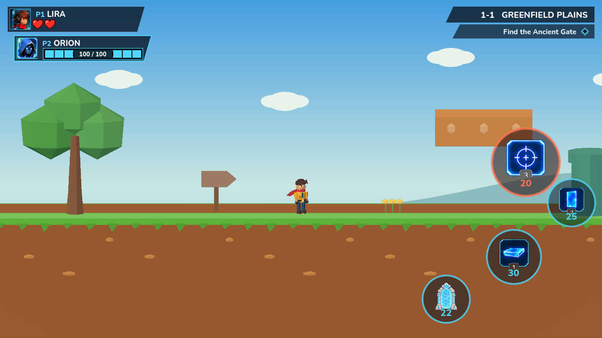
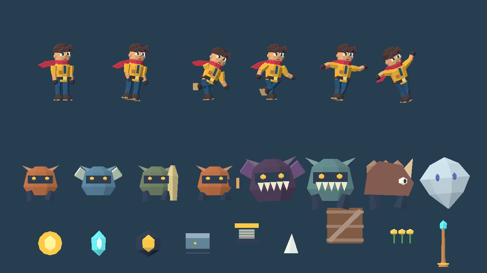
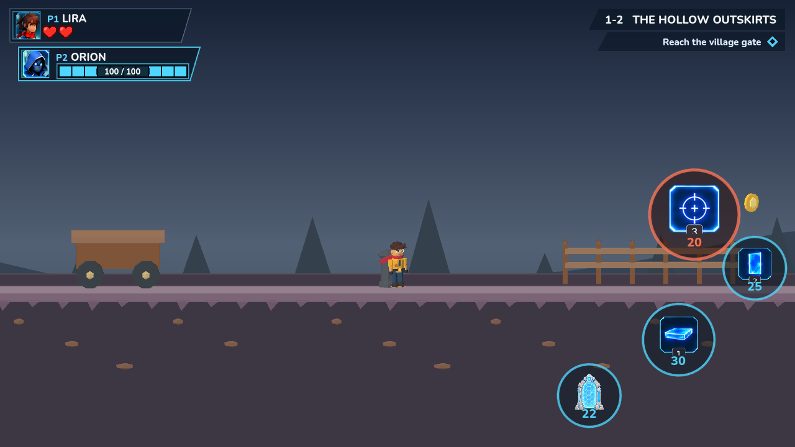

# Kiki 2.5D 移行・実装記録

調査開始: `recovery/unified` / `de89d2d`。push前に12コミットを取り込み、`a6f8a80`の最新1-2を含めて統合。2D物理・ルール・通信を維持し、描画を更新した実装。

## 1. 構成と座標

`main.gd`、`versus_main.gd`、`arena_main.gd`に、それぞれ1個の`World3D`描画層を追加する。
各層は独立した`World3D`を持つ透過`SubViewport`、正投影`Camera3D`、入力を受けない`TextureRect`で構成する。
背景はCanvasLayer -10、3D合成は-1、既存のゲーム内表示は0、UIは従来のCanvasLayer。
ホログラム、照準、配置プレビュー、突進予告、弱点、記号、取得待ちのリングは3D地形より手前に残る。

2Dの位置を`(x,y)`、描画上の奥行きを`d`、固定俯角を`θ=10°`とすると:

```
X = x × 0.01
Y = (-y + d sinθ) / cosθ × 0.01
Z = d × 0.01
```

モデルはピクセル単位で制作し、倍率`(0.01, 0.01/cosθ, 0.01)`で配置する。
カメラは固定俯角の正投影。わずかに上面を見せながら、ゲームプレイ平面の投影は2Dと一致する。
遠近による縮小はない。キャラクターの原点は足元、Runnerの原点は胴体中央なので、
`RUNNER_SIZE.y/2`を加えた位置にモデルを置く。カメラの範囲・中心は毎フレーム、
実際のViewportのcanvas_transformから求める。ガーディアンのズーム・パンにも同じ変換を使う。

根拠となるGodot 4.4の仕様:
[Camera3D](https://docs.godotengine.org/en/4.4/classes/class_camera3d.html) /
[SubViewport](https://docs.godotengine.org/en/4.4/classes/class_subviewport.html)。

## 2. 制作した素材

`src/render/three/`が制作元。Blender実行ファイルと一般的なインストール先、wingetを確認したが、
この環境では利用可能なものを見つけられなかった。外部モデリング環境への依存を増やさず、
Godot ArrayMeshで輪郭の押し出し・断面の接続を行う生成方式を採用した。
球や箱だけの仮キャラクター、3D風画像の板への貼り付けではない。

| 素材 | 実装 |
|---|---|
| LIRA | 顎のある頭、耳、鼻、目、眉、口、房状の茶髪、ジャケット、ベルト、赤いスカーフ、手袋、靴。肩・肘・股・膝・首を持つ階層モデル |
| 歩行敵 / 棘付き歩行敵 | 甲殻とバイザー、脚。棘付きは別配色と背中の棘 |
| 飛行敵 | 薄い立体翼と羽ばたき |
| Thornmite / Wisp | 最新1-2の石製四足獣と角、突進予告 / 尖った淡色の浮遊霊体 |
| 遺跡ブロック | 最新1-2の積み石と苔色の縁。元のセル数・寸法を維持 |
| 砲台 | 砲身と台座。照準方向と発射予告を維持 |
| 盾持ち | 前面の盾、背面の弱点表示と旋回予告 |
| Keeper | 大きな甲殻・歯・4脚。突進準備、突進、怯み、コア表示 |
| 追跡敵 / BlackHoleChaser | 大きな翼と歯を持つ追跡獣 / 暗い核を持つ別モデル |
| 地形 | 芝生の上面、面取りされた縁、色を分けた土側面、小石・層。ステージ別配色 |
| 足場・壁・ギミック | 移動床、崩れる床、門、バリケード、バネ、トゲ、スイッチ、ゴール、チェックポイント |
| 取得物 | 厚みのある刻印コイン、結晶 |
| 装飾 | 木、柵、花、標識、木箱、荷車、灯籠、根、墓標、旗、鳥、篝火、瓦礫、船底、アーチ等 |

21個の代表プレハブを`assets/models/*.scn`に保存した。寸法が異なる地形・小物・チーム色は
同じレシピから実行時生成する。プレハブは編集可能な静止ポーズのメッシュ／階層で、
アニメーションの制作元は下記スクリプト。プレハブだけを編集しても実行時には反映されない。
この区別は`assets/models/README.md`にも明記した。

再生成: `godot --headless --path . res://tools/export_three_assets.tscn`。
各モデルのポリゴン数は`assets/models/manifest.json`に記録。LIRAは1,040三角形・11描画部品。
敵は種類によって134〜376三角形。テクスチャ画像は新規に必要としない。

## 3. アニメーション

`lira.gd`は速度・接地・Runner.State・既存の姿勢フラグを読むだけで、Runnerへ書き込まない。

| 状態 | 表現 |
|---|---|
| 待機 | 頭とスカーフの微動。足元は固定 |
| 歩行・走行・スプリント | 速度連動周期、左右の腕脚、膝と肘の屈曲、前傾 |
| ダッシュ | 深い前傾、後方の腕、長い脚の姿勢 |
| ジャンプ上昇 / 頂点 / 落下 | 速度で判別する腕脚の姿勢。三段ジャンプも実際の同じ状態から駆動 |
| 着地 | 空中→接地の変化で短い圧縮 |
| しゃがみ / スライド | 胴体の圧縮と屈曲。速度で識別 |
| 壁スライド / 崖つかまり | 壁側へ伸ばす腕。壁キック後は上昇姿勢へ移る |
| グラウンドパウンド | 腕を上げ、脚を縮める姿勢 |
| 被弾 / 死亡 / 復帰 | のけぞり / 横倒れ / 通常姿勢への補間。既存の無敵時間による点滅 |

切替は指数補間。左右は視認性を維持する向きへ回転し、スカーフの向きも追従する。
敵は脚・翼と状態による姿勢を持つ。死亡した敵の3Dノードは元のEnemyの解放に追従する。
アニメーション専用のネットワーク送信や新しいゲーム状態は追加していない。

## 4. 既存機能との接続

- `Runner`の移動処理、加速、可変ジャンプ、三段ジャンプ、壁キック、地上／空中操作は変更していない。
- コライダー、ステージ配置データ、ホスト権限、通信パケット、勝敗、コイン台帳も変更していない。
- 地形は`terrain.slabs`から読む。元データを直接使わず、VeilFieldが役割別に隠した後の一覧を使う。
- 動的な物体はSceneTreeへの追加時に登録。新規Enemy、リスポーンによる再生成、移動床、取得物の消滅を追跡する。
- 元の2D絵のみself_modulateで消し、visibleは変更しない。非表示の敵が3Dだけ見えることを防ぐ。
- Gate / Switchの記号、Keeperの突進レーン、Shieldbearerの弱点、Turretの予告、崩れる床の復帰位置は2D表示を残す。
- ホログラム、ワープ、レーザー、上昇気流、戦闘の判定予告、HUDは意図的に2D。神視点の情報を優先した合成。
- 現行対戦は青い別衣装・足元のチーム表示を維持。旧4人アリーナも3Dモデルで描画し、味方同士は足元の縁色で識別する。
- 草原・空・静寂・ホラー・ボスで配色と背景を分ける。ステージ選択・進行は従来通り。

## 5. 性能方針・実測

- 描画用3Dは1Viewportにつき1個。キャラごとのViewportは作らない。
- 地形は最大512px幅に分割し、画面付近のチャンクだけ表示。長い対戦周回でも画面外を描画しない。
- 小物・敵のメッシュとマテリアルは共有。動的生成の登録は毎フレーム全探索せずnode_addedで行う。
- 3D描画解像度は横1,280pxまで、2x MSAA。UIはその端末の解像度のまま。
- 光源はDirectionalLight1灯＋環境光。リアルタイムシャドウ、被写界深度、ブルーム、SSAOなし。

Windows / AMD Radeon(TM) Graphics / Godot 4.4.1 / Vulkan Mobile / 1280×720で実描画。
1-1の測定では約207 draw calls・6,374 primitives（UIを含むフレーム全体）。
ウォームアップ後のフレーム間隔は中央値30.77ms、p95 32.99ms。
同じ試験のOpenGL Compatibilityは中央値16.58ms、p95 17.92ms。
これはデスクトップのVSync込み短時間測定で、GPU単体時間でもスマートフォンの保証値でもない。
60fps達成は保証しない。端末別の発熱・持続負荷・30fps下限は実機での確認が必要。

## 6. 検証

### 今回追加

`three_view_probe`: 実モデルの存在、入力を遮らない合成、ズーム0.8/1.5/2.4、
1600×720/960×720のサイズ変更における1px未満の座標一致、実Runnerの走行・上昇・落下・着地、
足場生成、全7ステージの3D構築、非対称ステージの地形と敵の非表示。
Vulkan MobileとOpenGL Compatibilityで全項目通過。ヘッドレスだけで画質を判定していない。

`three_gallery`: キャラクターと各姿勢、敵、小物を実際の3Dレンダラーで撮影・目視確認。
画像は`build/three-*.png`、採用した確認画像は本書の隣の`images/three/`。

### 既存の回帰

移動188項目、地上移動57項目、workshop35項目（移動床含む）、veil39項目、
協力端末一致32項目、stage45項目、sky54項目、keeper65項目が通過。
対戦ルール・通信・実プレイ・タッチ2端末も通過。タッチ検証には200ms RTTでの
両端末の死亡・復帰・操作再開が含まれる。

既存`run_tests`のWindows総合試験は完全greenではない。接続診断の6項目は変更前HEADでも失敗。
方向転換試験では、テレポート後に古い接地判定を読んで空中の加速を測っていたことを座標・速度の記録で確認した。
試験の準備で物理更新を待つよう修正し、実時間での独立再実行5回・50項目が通過。
加速時間の合格範囲とゲームの移動数値は変更していない。専用の移動・地上移動試験も通過。
修正後の総合試験は1,464項目中6項目が失敗（上記の既存接続診断のみ）。最新1-2の専用試験も通過。構文確認は164ファイルすべて通過。

## 7. 範囲と残る確認

これは実装済みの2.5D描画への移行であり、単なる設計書ではない。モデル・地形・状態連動を統合した。
一方、DS作品をそのまま再現するものではなく、独自の低ポリゴン表現である。
プロシージャルな関節アニメーションを採用しており、手付けの長い演技や表情アニメーション一式はない。
ホログラム・警告・UIは役割上2Dのまま。長い実機プレイでの美術調整、モデルの細かな接地演技、
モバイルGPUごとの性能調整には余地がある。

Android SDKはこのWindows環境の標準パスで見つからず、iOSのXcodeも利用できない。
既存のGitHub Actionsを実装commit `3212a8639fb98d00f460a88ca8a464909e1ba610`で起動した。
ワークフロー自体とエクスポート設定は変更していない。ストアへの提出も行っていない。

| 対象 | 結果 |
|---|---|
| [Android](https://github.com/555734/Kiki/actions/runs/35584561138) | GitHubの支払い／利用上限に関する制限でジョブ開始前に停止。APK未生成 |
| [iOS・署名なし](https://github.com/555734/Kiki/actions/runs/35584564362) | 同じ制限でジョブ開始前に停止。IPA未生成 |

両方の注釈は「recent account payments have failed or your spending limit needs to be increased」。
コンパイルが走っていないため、モバイルビルド成功とは扱わない。GitHub側の制限解消後に
同じ既存ワークフローを再実行する必要がある。スマートフォン2台での実機プレイ、GPU互換性、
長時間の性能・発熱、タッチ操作の最終目視確認は未実施。

主要変更: `src/render/three/*`, `src/render/sky*`, 三つのゲームルート、
警告を分離した既存visual数ファイル、`assets/models/*`, `test/three_*`,
`tools/export_three_assets.*`, `tools/verify.sh`。

## 8. 実描画の確認画像






