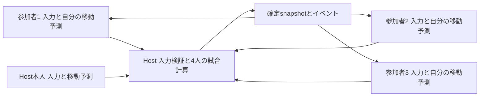

# Kiki「7コイン・チームバトル」仕様と段階的実装計画

> **旧提案・不採用（2026-09-20）:** この設計はユーザーの意図に合わず、現在の実装の仕様ではない。今後の対戦作業は [現行対戦の1対1兼任対応・通信改善設計](versus-1v1-network-plan.md) を参照すること。以下は履歴として残す。7枚・3分・小型アリーナ・4キャラクター案を現行ゲームへ戻さない。

## 0. 結論と文書の扱い

**最初に作る方式は、4人全員がキャラクターを操作する、3分間の2対2コイン争奪戦とする。** Kikiの改善済みの地上移動・可変ジャンプ・空中操作を使い、攻撃を一つに絞る。持ち帰る拠点や納品操作は設けず、持っているコインを守り、相手を攻撃して奪う。通信はまず同一LANの4台、その後にインターネット対応を判断する。

「各チームがランナー＋ガーディアン」は有力な第2候補だが、通常方式と同時に製品化しない。同じコインルールの比較実験として後段で試す。既存の協力用狙撃・救済を無変更で対戦に使えるわけではなく、非対称方式の方が必ず安く作れるという前提も置かない。

- 調査日: **2026-09-20**。
- 対象: `recovery/unified`、調査基準 **`f20dadbc337d79665f066fe30e68525ab78b68aa`**。fetch後、ローカルとリモート先端が一致していることを確認。
- 本成果物は設計のみ。**今回、ゲーム実装、Godot起動、テスト実行、ビルド、GitHub Actions／Codemagic起動は行わない。** 文書だけを同ブランチへcommit・pushする。
- 以下の「実装する」「テストする」は次工程の指示。数値は初期仮説であり、対戦の実機測定結果ではない。
- 既存の地上移動計画 `docs/implementation-plan.md` は上書きしない。本書は対戦モード専用の仕様・実装引き継ぎ。

## 1. 最新コードで確認したこと

READMEや過去の構想には古い説明が残る。現状の判定はソースを優先した。

| 領域 | 現在実装されているもの | 対戦に向けて未実装のもの／注意点 |
|---|---|---|
| `src/runner/runner.gd`、`src/autoload/balance.gd` | 地上の速度依存加速、弱入力曲線、可変ジャンプ、頂点緩和、空中操作、三段ジャンプ、壁キック、しゃがみ、pound等 | プレイヤーへの攻撃、対戦用ふっとばし、4体管理はない。既存take_damageはHPと協力用の被弾処理 |
| 同 `_begin_external_takeoff()`、`_settle_normal_state()` | 前回指摘した外部発射時の押下競合対策と、移動後の通常状態確定がコードに存在 | 今回は実行検証をしておらず、全遷移の正しさを再認定したものではない |
| `src/main.gd` | 単一runner／guardian、カメラ、チェックポイント復帰、協力セッションを組み立てる | Runnerを4回newするだけでは対応できない。死ぬとステージと建築物をリセットする処理も単一Runner前提 |
| `src/entities/pickups/coin.gd` | 単一Runnerに近づくと消える、ガーディアンのゲージ回復用pickup。各端末で表示を消す | 所持数、チーム得点、放出、永続coin ID、取得の権威判定はない。対戦コインとして流用不可 |
| `src/guardian/guardian.gd`、`abilities/*` | 足場・壁・狙撃・warp・射出、ゲージ、照準、協力支援 | 対戦用の陣営・射程・敵味方・対処可能な攻撃予告は別設計が必要 |
| `abilities/sniper_ability.gd` | 敵／shootable向けhitscan。通常命中半径26、補助110。一般的な射線遮蔽を必須にしない | ランナーを標的へ加えるだけでは、被弾側が反応しづらい無敵の攻撃役になる |
| `src/input/input_hub.gd`、`control_layout.gd`、`options.gd` | 指ID、左右配置、safe areaを考慮するタッチ操作、押下と解除の管理。モバイルauto sprintあり | 4人分の入力文脈、対戦の攻撃ボタンはない。複数InputHubの全てに同じ端末入力を読ませてはいけない |
| `src/net/party.gd` | player_id／role／teamの分離、TEAM_A/B、allied等の土台 | 現セッションはrunnerとguardianを同じteam Aへ登録。`holder_of(role)`は全体で一人を返すため、複数runnerに使えない。4席ロビーは未実装 |
| `src/net/transport.gd`、`enet_transport.gd` | 単一peer向けsend/poll。ENetでLAN接続 | listenの最大peer数は1、poll結果に送信者IDがない。4人化は定員変更だけでは足りない |
| `websocket_transport.gd`、`server/signaling/worker.js` | WebSocketでゲーム通信を中継。Workerの `MAX_PEERS = 2`、1170byte上限 | 4人ルーティング、peer認証、入力同期はない。TCPなので「unreliable指定」でも古いパケットによる後続待ちが生じる |
| `snapshot.gd`、`host_session.gd`、`client_session.gd` | Runner1体の通常14byte snapshot、State 3bit、30Hz送信。クライアントRunnerは物理を止めて補間 | 遠隔Runnerの入力・移動予測・4体snapshotはない。協力の状態enumへ対戦状態を足すとwireの幅を破る |
| `host_authority.gd`、`rewind.gd` | ガーディアンの遅れた足場を「Runnerに有利な方向だけ」遡って救済 | 対人戦で過去の被弾・コイン・撃墜を取り消すのには使わない |
| `Events`、`GameState`、Audio、HUD | actor IDを持たないrunner_died等、協力の進行・統計・演出 | 4人のイベントを流すと全員分の統計や復帰が混ざる。対戦専用の状態・イベント経路が必要 |
| EOS | docsやtransportコメントに将来案がある | `EOSTransport` の実装・組み込みSDKは今回のコード検索では見つからない。導入済みとして計画しない |

既存検証資産としてmovement／ground_movement／touch_feel／workshop／agreement等のprobeと `tools/verify.sh` がある。今回は読んだ範囲の静的調査であり、過去の成功件数を最新コミットの試験結果として流用しない。

## 2. 方式比較と採用理由

| 観点 | A: 4人ともキャラクター、2対2 | B: 各チームRunner＋Guardian |
|---|---|---|
| 遊びの中心 | 追う・逃げる・奪う・味方を守る。2人に分散して所持できる | 1人が全コインを運び、相方が進路・攻撃機会を作る |
| 初見の分かりやすさ | 全員同じルール、所持と撃墜が直結 | コインを持てず撃墜されない役を別途説明する必要がある |
| タッチ操作 | 左スティック＋右ジャンプ／攻撃の2ボタン | Runner操作と、Guardianの照準＋能力操作を両方調整する |
| Kikiらしさ | 現在の移動感を主役にできる。非対称性は弱い | 強い。会話と救済を競争へ広げられる |
| 対戦としての対処手段 | 攻撃者も近づき、反撃を受ける | 身体のない攻撃役をどう制限するかが重要 |
| 既存コードの利用 | 移動式、アート、入力設計。戦闘と複数体同期は新規 | 建築・ゲージの考え方は利用できるが、team化・対戦用能力・公平な遅延処理は新規 |
| 通信 | ホスト＋3人の移動入力と予測が必要 | 少なくとも非ホストRunnerの予測が必要。さらに2Guardianの競合処理 |
| 最小検証の変数 | 一つの攻撃、一つのステージ、共通操作 | Runner戦闘に加えて能力間の優劣と役割の満足度も検証 |
| 判断 | **最初の採用案** | **共通基盤が成立してから比較する実験案** |

Aを先に選ぶ理由は、今回の核心である「7枚を奪い合うことが楽しいか」を少数のルールで検証できるから。AとBを異なるチームに割り当てる混成マッチは作らない。Bの方が明確に楽しいという観察が出れば主方式を変更できるよう、role・team・actor所有者は分離しておく。

## 3. 基本ルールの補完

### 3.1 試合の流れ

- 4人、team A/B各2人。対戦専用キャラクターは全員同じ性能。1人1台の横持ちスマートフォンを正式な操作形態とする。
- ロビーで所属・操作説明を確認し、全員ready後に3秒カウントダウン。試合は **180秒、60Hzで10800tick**。
- 得点は「その時点でチームの2人が持つコインの合計」。累積獲得数・撃墜数・拾った回数を勝敗へ加算しない。預ける場所や味方へ渡す専用操作も設けない。
- 時間終了時、所持合計が多いチームの勝利。4枚を取った瞬間には終了しない。
- 同点なら最大30秒の延長。延長中は、単独リードを連続120tick（2秒）維持すると勝利。リードが消える／逆転したらカウントをリセット。30秒の期限で差があればその時点の多い側、同点なら引き分け。
- 延長でも新規コインは増やさない。結果確定後は物理と取得を止め、結果IDを一度だけ発行。再戦は新しいmatch_idで初期化する。

試合phaseは `LOBBY → COUNTDOWN → PLAYING → OVERTIME（同点時のみ）→ RESULTS`。通信待ちはPLAYING／OVERTIMEからPAUSEDへ入り、復帰すれば元のphase、中断ならABORTEDとする。最初の1枚はPLAYING開始時に生成し、通常試合の最終tickの移動・被弾・取得まで解決してから得点を確定する。終了後に届いた入力を延長や結果へ持ち越さない。

**7枚が奇数でも同点は起きる。** 3対3で1枚が地面にある、両チームが同時に撃墜される等があるため、同点規則は必須。

### 3.2 出現スケジュール

「合計7枚」は、試合を通じて新規発行される固有coin IDが7個という意味に固定する。同じコインの放出・再出現は8枚目に数えない。

| 経過時間 | 新規枚数 | 地点 |
|---|---:|---|
| 0秒 | 1 | 主床中央 |
| 40秒 | 2 | 主床の左右対称地点 |
| 80秒 | 2 | 左右の中段足場 |
| 120秒 | 2 | 主床中央と上段中央 |

各出現を2秒前から予告し、全端末へ同じ位置を表示する。初期試合は地点と時刻を固定して比較しやすくする。左右をランダムに有利にしない。後半に残る2枚がリード側にも中央へ戻る動機を与える。

取得は空中でも可能。生存し、復帰無敵中でないactorの身体矩形に対し、コイン中心からの最短距離18px以内を候補にする。地形を挟んだ取得は不可。描画上の上下動を判定位置に含めない。最小版のコイン表示径は26pxから始め、所持数表示との混同を避ける。

出現地点が何かで塞がれた場合は、同じ段の事前検証済み代替地点へ移す。キャラクターはコインの出現を阻止しない。出現直後は全員に対して12tickの取得待ちを設け、待ち伏せの有無は予告で見えるようにする。

### 3.3 ダメージとコイン放出

- **成立した一回の被弾で、所持があれば1枚だけ放出。** 所持0でも被弾・ふっとびは成立する。無敵により拒否した攻撃は放出を起こさない。
- プレイヤー間の接触だけではダメージを与えない。味方への攻撃は無効。味方同士・敵同士の身体による押し合いも最小版では行わない。
- 放出するcoin IDは所持IDの昇順から1個。攻撃者へ直接加算せず、ワールドに出す。味方も相手も拾える。
- 放出位置は被弾者中心の少し上。初速は攻撃者側へ水平160、上へ280px/sを初期値とする。地形内部なら最寄りの有効放出点へ補正、見つからなければ再配置待ちにする。
- 放出後18tick（0.30秒）は誰も取れず、元の所持者だけは45tick（0.75秒）取れない。押しっぱなしで即回収する循環を防ぎ、味方による回収もチーム戦の選択にする。
- コイン自体の重力1200、終端600、床反発0.25、2回反発後は停止を初期値にする。コイン同士は衝突させない。全てホストが更新する。

### 3.4 撃墜時、場外コイン、コインの保存

- 撃墜は左右／下の撃墜境界を身体中心が越えた場合。HPが0になる方式は採用しない。上方向は天井で制限し、最小版には上撃墜を設けない。
- 撃墜者の所持は即座に0。**残りの全コインを返却する。消滅も相手への自動加点もさせない。** 最後の安全な放出位置がある場合はそこへ扇状に放出し、ない場合は再配置待ちへ送る。
- 安全な放出位置は「場内かつ地形と非重複、下80px以内に静止床がある点」。毎tick更新するlast_safe_drop_positionを使い、撃墜境界の外へ全コインをばらまかない。
- ダメージで1枚を放出した同じtickに撃墜された場合は、残った分だけ処理する。4枚持っていたなら常に合計4枚が返却される。
- ワールドコインが場外へ落ちる、地形に埋まる、出てから8秒間誰にも拾われない場合は再配置待ちへ。最後の1秒を点滅表示する。
- 再配置待ちは60tick（1秒）。その後、中央寄りの事前登録地点から、最近使われていない有効地点を優先して再出現。複数枚は地点を分散する。原則の取得待ち12tickを再び適用する。
- 所持中のコインには8秒期限を付けない。取得後に勝手に失う仕様にはしない。

コイン台帳は常に次の不変条件を満たす。

```text
UNSPAWNED + WORLD + HELD + RECYCLE_PENDING = 7
各coin_idは、上記のどれか一状態だけに属する
HELDのownerは、そのmatchで有効なplayer_id一人だけ
team_score = HELDのownerをrosterのteamで集計した値
```

得点を別の独立カウンタとして加減算しない。切断・再送・同時取得で台帳と得点がずれる原因になる。

### 3.5 同時処理の順序

ホストの各tickを固定順にする。

1. 入力受理・復帰／無敵タイマー更新、予定コイン出現。
2. 4人の移動と攻撃フェーズ更新。actor同士は物理衝突しない。
3. 同じ時点の形状から全攻撃の命中候補を集める。無敵と敵味方を判定。
4. 被弾者ごとに一つの命中を確定し、ダメージ・放出・ふっとびを適用。
5. 場外判定、撃墜による残コイン返却と復帰予約。
6. コインの移動／再配置と取得判定。撃墜済み・復帰無敵中のactorは取得できない。
7. 台帳から得点を算出し、通常終了／延長／結果を判定。snapshotと確定イベントを作る。

同時に互いを攻撃した場合は相打ちを許す。二人が同一被弾者を同tickに攻撃しても、ダメージ・放出は1回。大きいふっとびを優先し、同値ならmatch seedからの抽選で固定player IDの有利を避ける。一撃は最も近い敵1人にのみ当たる。同時にコインへ触れた場合も、中心距離が短い方、距離差1px未満ならホスト抽選とし、結果を送信する。クライアントの「先に拾った」申告は採用しない。

## 4. 戦闘と移動の最小仕様

### 4.1 継承する操作感とモード内の制限

現行のW=273.6、sprint=410.4、地上加速1800→1400、減速2280、反転3420、地上入力曲線0.50、可変ジャンプと空中係数を出発点にする。地上と空中の曲線を一括変更しない。対戦でのsprintは全員常時有効とし、別ボタンを要求しない。弱く倒したときの低速操作は残る。

最小版の移動は、走行・可変ジャンプ・空中左右操作・コヨーテ・先行入力まで。三段ジャンプ、壁キック、しゃがみ／slide、pound、ledge hang、旧DASH能力、warp、移動床は**対戦用profileで無効**とする。既存協力モードの機能・値は維持する。これらを全て戦闘技へ変換することは、7枚ルールの検証に必要ない。壁キック等の再導入はステージとネット予測の試験を追加してから判断する。

### 4.2 一つの攻撃「はじき」

| 項目 | 最小版の初期値 |
|---|---|
| 入力 | ATTACKの新規押下1回。保持による連打なし、チャージなし |
| 方向 | 押下時の水平入力が絶対値0.15超ならその向き、ほかはfacing。1回の攻撃中は固定 |
| 予備動作／有効／後隙 | 8 / 4 / 14tick、合計26tick（約0.43秒） |
| 判定 | actor中心から前38px・上4pxに幅54×高さ44pxの矩形。静止地形で遮られた相手には当てない |
| 地上／空中 | 同じ技。空中攻撃で浮いたり落下速度を消したりしない |
| 移動 | 攻撃中も通常の移動とジャンプを許す。被弾で攻撃中断 |
| 1回の命中 | 相手1人・1回。attack_instance_idで重複排除 |
| ふっとび蓄積 | 0〜100。被弾ごとに+20、復帰時0。コインの枚数とは独立 |
| ふっとび初速 | 被弾後蓄積pに対し `vx = 攻撃方向*(300 + 2.5*p)`、`vy = -(210 + 1.8*p)` |
| 被弾硬直／被弾無敵 | 10tick（0.167秒）／36tick（0.60秒） |

硬直中は入力による水平速度変更、ジャンプ、攻撃を禁止し、上昇／落下の基準重力は適用する。水平dragは毎秒300で0へ近づける。プレイヤージャンプの頂点緩和・解除重力は終了させ、空中に静止させない。硬直終了後は通常の空中／地上操作へ戻す。被弾で蓄積が増えても、立っているだけで自然減少はさせない。

被弾時に既存ジャンプバッファを消費し、硬直中の新しいjump／attack edgeも消費して破棄する。解除後に攻撃がまとめて発火しない。硬直明けには方向入力は即反映するが、ジャンプ・攻撃は新しい押下が必要。通常の攻撃後隙中もattack edgeを破棄し、先行連打キューは設けない。

既存 `Runner.take_damage()` のHP・facing依存ノックバックを対戦に流用しない。対戦用 `CombatState` で攻撃方向、蓄積、硬直、無敵、命中済み対象を管理する。ふっとびは速度を加算し続けず、上記の初速へ設定する。多重命中の際に速度が無制限に増えない。

命中確認は輪郭の発光・短い振動・効果音で行う。世界の時間を止めるhit stopは最小版では入れず、描画だけの短い強調にする。復帰直後の無敵と被弾無敵は色と点滅を分ける。蓄積は小さい数値バーで見せ、HPと呼ばない。

### 4.3 チーム戦としての狙いとリスク

味方は、所持者を追う敵をはじく、落ちたコインを拾う、次の出現を取りに行く、のいずれかを選べる。コインを一人へ集めれば守りやすいが、その人の撃墜で全て失う。二人へ分散すれば全損リスクを下げられる。専用の職業や支援ボタンがなくても役割が生まれるかを検証する。

懸念は、リード後の逃げ続け、集団での連続攻撃、コインの取り返しが見えにくいこと。対策は短い試合・全員が見える小アリーナ・被弾無敵・放出待ち・後半出現から始める。コイン所持による自動減速や強制没収は最初から入れない。逃げ一辺倒なら、まず足場間隔と追撃経路を修正する。

## 5. リスポーン

- 撃墜後60tick（1秒）で復帰。無制限の残機制。撃墜数は結果の参考統計であり勝敗の同点判定には使わない。
- 各ステージに最低8個の候補を登録。床上で身体が収まり、頭上に空間があり、撃墜境界から十分離れ、通常ジャンプで主床へ戻れることを事前検証する。
- ホストが「地形と非重複・床あり・敵から160px以上・有効攻撃領域から120px以上・他の復帰予約と非重複」を満たす候補を選ぶ。直前と同じ地点は、他に候補があれば除く。安全候補の中からランダムに一つ選ぶ。
- 候補が全て敵に近い場合は最大60tick待ち、その後、地形条件を満たす候補のうち敵から最も遠い上位2点から抽選する。無限に待たせない。「敵から距離を取れる」と「地形として安全」を分ける。
- 復帰後72tick（1.2秒）は無敵。移動・ジャンプはできるが、攻撃・コイン取得は禁止。無敵のままコインを拾う／攻撃することはできない。
- 復帰時は所持0、蓄積0、速度0、入力バッファ／攻撃／硬直／ジャンプ履歴を初期化する。過去のattack IDと入力epochは無効化し、新しいspawn_epochを使う。
- 復帰地点はホストが決めて送信する。各クライアントが別々に乱数を引かない。

## 6. ステージ・カメラ・タッチUI

### 6.1 灰箱ステージ1枚

既存の長い協力ステージは流用しない。専用の左右対称アリーナを作る。初期座標案は以下。Yは下が正、単位px。位置は床の上面を記載。

| 形状 | 初期配置 |
|---|---|
| 主床 | x=-360〜360、上面y=120、厚さ32 |
| 左右中段 | x=-290〜-110／110〜290、上面y=0、厚さ20 |
| 上段 | x=-80〜80、上面y=-110、厚さ20 |
| 撃墜境界 | x<-480、x>480、y>240 |
| 上の制限 | y=-360に天井。上撃墜なし |
| 初期のチーム位置 | Aは主床左、Bは主床右。各チーム内の2体は50px以上離す |
| 新規コイン位置 | 主床(0,90)、主床(±240,90)、中段(±200,-30)、上段(0,-140) |

床は静止した通常の固体。最小版は一方通行床・斜面・破壊床・ステージギミックを入れない。120/110pxの高低差は現在の通常ジャンプを基準に選んだ仮値で、実装後に実体の寸法・頭上衝突を含めて到達性を測る。主床から左右に落ちる穴を設け、中央に立っているだけで一撃撃墜される配置は避ける。

復帰候補の初期例は主床x=±80/±200/±300と中段x=±200。頭上足場との間隔、他候補との重なりを検証して確定する。コイン出現点・復帰候補・コイン再配置点は別リストとし、同じ用途だと仮定しない。

### 6.2 カメラ

- 全端末が同じアリーナ全体を見る固定カメラ。Runner追従・Guardianによるpan・スコープは使用しない。4人を追うたびに拡大縮小する方式も最初は使わない。
- safe area内にゲーム領域とタッチ領域を確保し、撃墜境界と全床を画面へ収める。アスペクト比ごとの見える範囲の差で有利を作らない。
- 自分は太い輪郭＋頭上の「YOU」、味方は共通形状、相手は別形状。A/Bの色だけに識別を依存しない。個人の所持枚数を頭上、チーム合計と残り時間を画面上部へ表示。
- 各コインのWORLD／HELD状況を7個の小アイコンでも表示。敵所持者の位置は常に見えるため、隠れて時間を潰す戦術を主役にしない。
- 最小対象端末で身体の表示高さ28dp程度、ボタン48dp以上を目安に実機確認。全体表示で人物が読めないなら、先にステージ横幅やUI配置を縮める。無制限にzoom outして解決しない。

### 6.3 タッチ

左親指は水平アナログスティック、右親指は大きいJUMPとATTACK。auto sprint固定、上下入力でpoundやジャンプを誤発火させない。JUMPの保持と解除を独立して扱い、ATTACKへ指を動かした瞬間を「ジャンプ保持継続」にしない。

指IDごとの所有とreleaseを管理し、focus喪失・タッチcancel・画面端へ出た指でも押下を残さない。既存のsafe area計算や配置編集の考え方を使い、保存キーは `arena_controls_v1` として協力のレイアウト設定を上書きしない。端末共有4人タッチ、チャット、ピンチ操作、複雑な方向別攻撃は対象外。

ジャンプと攻撃を同時に保持できる配置にするが、攻撃操作のために3本指を要求しない。ジャンプ中に右親指をATTACKへ移すと短押しになることも含め、既存可変ジャンプの習得感を評価する。必要ならボタン間隔を調整し、最初から自動ジャンプ保持には変えない。

## 7. 協力プレイを壊さない実装境界

### 7.1 別の試合ルート

新規 `src/arena/arena_main.tscn` と `arena_main.gd` を対戦のrootにする。初期検証はこのsceneを直接起動する想定とし、協力の起動経路を変更しない。採用決定後に既存メニューへ「協力」「コイン対戦（試作）」の入口を設け、対戦へ移るときは協力rootとsessionを終了する。両rootを同時に動かさない。

`ArenaMatchState`、`ArenaRoster`、`ArenaEvents` は対戦root配下のインスタンス。GameStateのチェックポイント、協力の `Events.runner_died`／`coin_collected` 等へ対戦の出来事を流さない。Audio・FXの呼び出しもactor ID付きのarena eventから必要な演出へ橋渡しし、協力イベントを偽発火させない。協力の保存データは対戦中に変更しない。

P5のモード切替では協力sessionのsocketを閉じ、残る入力所有とsignal接続を解放する。GameStateの協力タイマーも停止し、対戦中に協力のelapsedが進まないようにする。再び協力へ入るときは既存の開始／復帰契約で初期化し、対戦のepoch・team・layoutを持ち込まない。対戦パラメータを調整するときはArenaRulesへ分離し、協力用Balanceの値を対戦の都合で変更しない。

### 7.2 移動コードの再利用範囲

Runnerをそのまま複製／継承して `_ready()` だけ差し替える案は採用しない。現在のRunnerはグローバルイベント、HP、単一のInputHub、協力用接触に結び付いている。

- `ArenaFighter` と `ArenaMotor` を新設。保持するのは第4節の限定した移動機能のみ。
- `Runner.ground_input/ground_target/ground_step` は既に純粋な計算なので、初期はそのまま呼び出せる。地上値は現在のBalanceを参照する。
- ジャンプの重力計算は入力状態と明示的なジャンプ状態を受け取る小さな共有helperへ抽出する。Runner側を同じhelperへ置き換える場合は、協力probeの前後一致を先に確認する。分岐順、delta、最小時間、解除のラッチ、頂点予算を変えない。
- 共有化は移動の数式まで。接触解決、対戦の被弾、台帳、ネット同期を既存Runnerへ押し込まない。全移動システムの一括再設計を前提にしない。
- 最小版は静止した軸平行矩形だけなので、ArenaMotorの接触は明示的なsweep／slideと床probeで扱う。hostと予測側が同じ `step(state, input, collision_world, dt)` を使う。身体は30×46、safe marginと床snapも明示パラメータにする。
- Godot側のmotion queryを使う場合は `PhysicsServer2D.body_test_motion()` 等で移動元transformとmotionを指定し、最大4回のslideで止める。接地・壁・天井を返り値として状態に保存する。接触判定を一度も行わず、positionだけを戻して `is_on_floor()` が復元されたと見なしてはいけない。[Godot 4.4 PhysicsServer2D](https://docs.godotengine.org/en/4.4/classes/class_physicsserver2d.html)
- プロトタイプの段階で、静止床の段差・角・低い天井を同じ入力で再実行し、再現可能な接触処理を確立する。協力Runnerと同じジャンプ高さ・停止距離から外れた場合は調整ではなく移植差分を先に直す。

これは4人全体の決定論的ロールバックを約束するものではない。対戦root専用の限られた地形と移動を、hostが訂正できる形で実装する。

## 8. データとチーム管理

| データ | 必須フィールド／責務 |
|---|---|
| `ArenaRoster` | match_player_id、transport peerとの結び付け、team_id、role、actor_id、ready、接続状態。4席、各team2席を検証 |
| `ArenaMatchState` | match_id、rules_version、map_hash、phase、tick、phase_end_tick、seed、得点導出、result_id |
| `FighterState` | actor_id、owner、spawn_epoch、位置／速度／向き、MotorState、CombatState、復帰予約 |
| `MotorState` | grounded／床法線、coyote、jump buffer、押下・解除シーケンス、jump age、active/released、解除重力時間、apex残予算／終了、前tick入力。サブtick情報を暗黙に持たせない |
| `CombatState` | pressure、攻撃IDとphase／残tick、固定攻撃方向、hitstun、被弾無敵、復帰無敵、消費済みattack sequence |
| `CoinRecord[7]` | coin_id、state、owner/null、position／velocity、revision、spawn予定、取得解禁tick、former_ownerと解禁tick、再配置tick、出現からの年齢 |
| `ArenaEvent` | match_id、event_id、tick、actor_id／coin_id、revision／spawn_epoch、kind、必要な結果値 |

`player_id != peer_id != actor_id != team_id` を契約にする。peerは再接続で変わり得る。端末の既存client_idを本人認証だと思わない。ロビーは接続元peerへ席を割り当て、その接続が操作できるactorをhostが固定する。

Partyの概念は利用するが、対戦では `members(team)` と `actors_for(team, role)` を使う。全体で一人しか返さない `holder_of(role)` を4人管理に呼ばない。既存Partyと協力handshakeは変更せず、ArenaRosterから必要な概念を独立して実装する。

途中参加はロビーまで。試合中の補充・観戦は最小版に入れない。チーム変更はロビーのみ、変更時は全員のreadyを解除する。初期は2人ずつ手動選択し、再戦では左右を交換する。team IDとステージの左右は別データにする。

## 9. 通信・ホスト権限

### 9.1 採用する構成

**一人の端末をlisten hostにするスター型。hostだけが4人の物理、被弾、コイン、復帰、勝敗を確定する。** クライアントは入力を送る。所持数・得点・命中・復帰位置をクライアントから確定値として受け取らない。



P0/P1の単一端末では同じhost計算をローカルで呼ぶ。P2ではENetの4人用transportを新設し、host側にpeer辞書を持たせる。インターフェースは `send_to(peer_id, channel, reliability, payload)`／`broadcast(...)`／`poll()->{sender_peer_id,channel,payload}`。既存の2人用NetTransportは互換維持し、定員だけ増やして全相手へ無差別転送する変更はしない。

P2のhostは部屋を作った人。インターネット段階ではロビーで最大RTTと端末負荷を測り、開始前に候補を提示できる。roleやteamがhost権限を決める規則にはしない。試合中のhost移譲は対象外。

### 9.2 公平性と遅延の範囲

既存協力では唯一のRunnerがhostなので予測不要だった。対戦でクライアントの入力を待ってから描画するだけでは操作が重くなるため、**自分の移動だけを即座に予測し、host結果で補正する**。相手は短い補間で描画し、コイン取得・与ダメージ・撃墜はhost確定まで仮表示にする。

全員の入力には同じ予約猶予を使う。LAN初期値2tick。試合前の最大RTT/2とjitterから2〜6tickの範囲で決め、試合中は固定する。host本人も同じ予約tickへ入力し、表示は予測で応答させる。これでhost側だけ予備動作が早く始まる差を減らすが、host自身による改ざんまでは防げない。

予備動作の描画は自分の入力で先行開始してよいが、相手へ当たった表示は先行確定しない。host本人にも予測用の表示と確定bodyを分け、host本人だけ確定bodyを即時操作する例外を作らない。

最小版は**過去へ遡って相手を被弾させない**。送信者の時計を信じてコイン所有や撃墜を巻き戻すこともしない。協力用の有利な救済は無効。代償として高遅延では画面と確定命中に差が出るため、近接攻撃の予備動作と中程度の試合速度を採用し、RTTが大きい対戦を品質保証しない。

LAN目標はRTTの95パーセンタイル40ms以下。Internetの暫定目標は120ms以下・jitter15ms以下・loss1%程度まで。150ms超が続く場合はロビーで警告して開始を推奨しない。これらは接続可能性の断定ではなく、後述の実測gate。

### 9.3 入力・予測・訂正の契約

- 物理60Hz、入力sample60Hz、送信30Hz。各packetに直近6frameを重複収録。frameはtarget_host_tick、input_seq、水平axis、jump held、jump press/release sequence、attack sequenceを持つ。attackやjumpを毎tick新規押下に変換しない。
- clientは同期したhost時刻に予約猶予を足したtickへ入力を割り当てる。hostはそのtickで一つだけ実行し、過去frameをまとめて複数回シミュレートしない。重複・極端な未来・古いepochは破棄する。
- 遅れて届いたframeはその過去tickへ適用しない。後続の有効frameに含まれる新しいpress sequenceは一度だけ解釈できる。押下後すでに解除されていれば短押し扱いにする。欠落時は直近のheld入力を最大6tick継続し、その後neutral＋releaseとする。
- hostは各tickの確定状態と、消費した入力seq／press sequenceをsnapshotへ含める。clientはsnapshot tick TへMotorStateを戻し、保存したtarget tick T+1以降の入力を再適用する。ackされた押下を再発火しない。
- 位置／速度だけでなく、第8節MotorState・CombatStateの全てを自分用の訂正データに含める。`is_on_floor()` の内部キャッシュ、グローバルClock、演出イベントを再実行の状態保存に代用しない。
- 予測の地形は静止床だけ。相手の身体、コイン、建築物、移動床は予測衝突へ入れない。再実行中は音・放出・得点変更を発火しない。
- 入力履歴は120tick保持、1回の再実行は最大12tick。長い欠落ではfull stateを要求し、その間に無制限の未来予測を進めない。補正後の物理位置は即時確定し、描画だけ最大80msで追従。24px以上の誤差や撃墜／復帰は即時切替。
- 遠隔actorの補間bufferはLAN50msから開始。時刻は対戦専用clockで管理し、Clock autoloadを変更して協力側へ副作用を出さない。試合結果はclient時計で判定しない。

Godotの異なる端末間で完全に同じ浮動小数点物理になるとは仮定しない。全世界ロールバックや全員のlockstepよりも、限定した自分の移動予測とhost訂正を先に作る。静止地形の再実行が安定しない場合はこの工程を止め、動く足場や建築を追加しない。

### 9.4 対戦専用wire形式

協力のProtocol／Snapshotを拡張せず、`ArenaProtocol` に独立したmagicとversionを持たせる。

| channel | メッセージ | 配信／頻度 |
|---|---|---|
| CONTROL | HELLO、WELCOME、ROSTER、READY、START、FULL_STATE、RESULT、RESUME | reliable ordered。mode/version/map hash不一致は開始前に拒否 |
| INPUT | 直近6frameの入力 | unreliable、30Hz。seqとtarget tickで重複・順序を処理 |
| SNAPSHOT | tick、4actor、全7coinの状態、phase、終了tick、各team所持、自分用訂正 | unreliable、30Hz。古いtick/revisionは捨てる |
| EVENT | HIT、DROP、KO、RESPAWN、COIN_PICKUP等の確定演出 | reliable ordered、event IDで一度だけ適用 |

所有と結果の正本はsnapshot／full state。イベントを取り逃しても次のsnapshotで修復する。新しいsnapshotを受けた後に遅いDROPイベントが届いても、古いrevisionで所有を戻さない。RESULTはmatch_idとresult_id付きで再送可能にする。

初期byte予算はsnapshot **768byte以下**、input packet **160byte以下**、アプリの単一packetはtransport上限1170byte以内（framing込み）。snapshotは4actor×48、7coin×24、自分用状態160、header等を含めても768以内に収める設計を目指す。これは既存14byteを4倍した見積もりではない。実装時にserializerの最大値テストで測り、足りなければ送信項目を整理する。reliable full stateは上限付きchunkとtransfer IDで復元し、巨大packet一個にしない。

上限payloadベースのhost送信は768×30×3≒69KB/s、client入力合計は160×30×3≒14.4KB/s。3分のhost送信は約12.4MBにヘッダ・再送が加わる。これは設計上の予算で、実通信量は未測定。端末の通信量・発熱も4台試験で確認する。

### 9.5 不正入力・切断

hostはsenderと席を照合し、axis範囲、frame数、最大packet、攻撃周期、jump条件、map/version、未来tick、seqを検証する。クライアントがpayloadのactor_idを変えて別人を操作できないようにする。LANの席復帰にはhost発行のランダムresume tokenを使い、単なるclient_idや部屋番号だけで席を奪えないようにする。

最小版は友人同士のカジュアル戦。端末hostの改ざん、意図的な遅延、不正な勝敗表示を第三者サーバーなしで完全に検出できるとは主張しない。ランキング・課金報酬・永続レートは作らない。

入力停止時のneutral化は前項どおり。1秒の通信断を検出したら、hostはそのtickで試合を一時停止し、最大10秒の再接続待ちを全員に表示する。match中の待機は一度だけ。再接続時は同じ席と台帳をfull stateで復元し、入力epochを更新して3秒カウントから再開する。タイムアウト／二度目の断／host消失では「通信中断・勝敗なし」で終了する。切断したactorを消してコインだけ消失させない。結果確定後の断は確定結果を変更しない。

PAUSED中は試合tick・コイン年齢・無敵・攻撃・復帰予約を全て停止する。10秒の接続待ちと再開カウントは単調な実時間で測り、CONTROLのpollとheartbeatは継続する。保留入力は捨て、再開時に全員のheld状態を再取得する。古いedgeをカウント明けに再利用しない。

host migrationとCPU代役は後回し。中断悪用を競技的に罰する制度も最小版にはない。この限界を友人向けモードの説明へ明記する。

## 10. 継続費用を抑える方針

### 10.1 段階別の選択

| 段階 | 通信方式 | 継続費用と判断 |
|---|---|---|
| P0/P1 | 単一端末のローカル試験 | サーバー不要。4人のゲーム性を先に確認 |
| P2 | 4台・同一LANのENet | 開発者の常設サーバー費用0。家庭外接続やNAT越えは保証しない |
| P3 | EOS Connect／Lobby／P2Pを第一候補に実機調査 | 自前ゲームサーバーを置かず、無料の接続基盤を利用する方針。ただしGodot用native統合は未実装 |
| 保留 | 現行Cloudflare WebSocket relayの4人版 | 対戦ではTCP待ちが効き、トラフィックも増える。無料枠・品質を測る前に正式経路へ採用しない |
| 非採用 | 自前の常設専用サーバー／自前TURNを必須化 | 現在の費用目標に合わない。公開競技性が必要になったときの別判断 |

ENetのLANとInternetの到達性は別問題であり、アプリで4人を受け付けるだけでは家庭のNATを越えられない。[Godot 4.4 networking](https://docs.godotengine.org/en/4.4/tutorials/networking/high_level_multiplayer.html)

EOSは公式に無料のオンラインサービスとして提供され、Android/iOS用SDKも案内されている。P2PによるNAT／relayの利用実例もある。ただし、それはKikiのGodot 4.4.1へ一ファイル追加すれば動くことを意味しない。native binding、両OSでのパッケージング、認証方式、Lobbyの参加、P2P受信、復帰、relay強制時の遅延を独立した調査工程にする。[EOS公式](https://onlineservices.epicgames.com/)、[EpicによるP2P導入事例](https://onlineservices.epicgames.com/spotlights/sega-delivers-global-crossplay-in-sonic-racing-crossworlds-with-epic-online-services)

EOSがその工程で成立しなければ、**LAN版として成立させたままInternet公開を保留する**。無断で有料サーバーへ切り替えない。無料サービスの条件変更・停止までは制御できないので、「人数が増えても永久に必ず0円」は約束しない。ストア登録費、端末、配布ビルド費、ユーザー自身のモバイル通信費はサーバー継続費とは別。

### 10.2 現行relayの費用説明に関する注意

`server/signaling/README.md` 前半の「最初の紹介だけで通信は流れない」という説明は、現在のバイナリゲーム中継実装へそのまま適用できない。2人から4人への変更では、宛先と認証だけでなく実メッセージ数も測り直す必要がある。

Cloudflareの公式料金では、Durable Objectsの無料枠に上限があり、受信WebSocketメッセージも課金用requestへ換算される。無料枠超過時は対象操作が失敗する。hibernationがあっても、頻繁な試合通信を無条件に無料にはできない。[Durable Objects料金・2026-09-20確認](https://developers.cloudflare.com/durable-objects/platform/pricing/)

例えば個別宛てsnapshotを90回/秒、3人のinputを合計90回/秒中継する方式なら、3分で受信32400メッセージ。現行20:1換算では約1620request相当で、接続・制御・実行時間等は別。この計算は方式比較用であり、無料で遊べる試合数の保証ではない。relayを再検討するときは送信の集約、実行時間、混雑時の拒否、課金上限を確認してから判断する。

## 11. 非対称方式の比較プロトタイプ

Aのルールと測定環境を作った後、Bは以下に絞る。正式採用の約束ではない。

- 4人2チーム、各チームRunner1人＋Guardian1人。身体と所持を持つのはRunnerだけ。勝敗のチーム合計はそのRunnerの所持数になる。Guardianはコインを取れず撃墜対象でもない。
- Runnerの攻撃・ジャンプ・コイン台帳・復帰はAと同じ。試合中に役割を交換せず、試合間に交代する。
- Guardianは固定カメラで全体を見て、照準と2能力だけを操作。協力版の全4道具を移植しない。

| 能力 | 比較用初期仕様 |
|---|---|
| 足場 | 幅120、厚さ20、3秒、teamごと最大1個、コスト35。味方Runnerから300px以内。0.2秒予告後に出現し、両teamが乗れる |
| パルス | 半径40、0.3秒予告の後に1回、コスト30、cooldown1.5秒。味方Runnerから300px以内。敵Runnerにpressure+10とコイン1枚放出を伴う弱い横ふっとび |
| ゲージ | teamごと100、毎秒+8。コイン取得で回復しない。両team間で共有しない |

足場はactorやコイン出現／復帰領域に重ねて閉じ込められず、敵の攻撃1回で壊せる。パルスは床を貫かず、予告後に逃げられることを必須とする。無制限射程の照準hitscan、協力版110px aim assist、warp、発射、過去へ遡る救済は入れない。Runner撃墜中は能力実行を止め、予約中のパルスを取消す。ゲージは回復を続ける。

予告はhostの確定tickから全員へ同じ実行tickとして配る。遅く届いたclientにだけ即時発動させない。動的足場を移動予測へ加えるには、その出現／消滅／破壊の履歴も再実行対象にする必要があるため、P2の静止地形版へ安易に混ぜない。

比較する問いは「Guardianが何かを待つだけにならないか」「Runnerが自分の操作より見えない支援攻撃で勝敗を決められたと感じないか」「通常2対2より会話と役割交代の楽しさが増えるか」。まずローカルで試し、両役の評価が揃わなければBを製品化しない。

## 12. 最小プロトタイプと実装順序

各段階は次の条件を満たしてから進む。以下のコード・テスト・実機起動は将来の実装作業であり、今回実行しない。

| 段階 | 作る範囲 | 作らないもの | 進む条件 |
|---|---|---|---|
| P0: 規則と接触の確認 | 台帳7枚、固定時刻、被弾／撃墜／復帰／終了の純粋な試合処理。2体の灰箱で一つの攻撃と移動を確認 | ネット、メニュー統合、アート追加 | 保存則、同tick処理、短押し、接触再実行が自動試験で成立。2体試験だけでチーム戦を評価済みにしない |
| P1: 遊びを確かめる最小版 | 同一PC＋独立した4入力（主に4 gamepad）、4人2対2、1マップ、1攻撃、180秒、固定カメラ、結果と即再戦 | AI、EOS、ランク、複数キャラ、能力選択 | 4人で少なくとも12試合。第13節の遊びのgateを確認 |
| P2: スマホの最小版 | 4台LAN、ArenaTransport、入力予測と訂正、roster、2ボタンタッチ、切断処理、same-build検証 | Internet、host移譲、動的地形 | 4台のタッチで12試合以上。自動試験と遅延試験、協力回帰、端末性能gateを通す |
| P3: Internetの成立性 | EOS native統合の独立調査、4台接続、Lobby、relay時の通信、再接続／画面復帰 | 公開ランキング、課金報酬、専用サーバー | Android/iOS混在・異なる回線で品質と継続費条件を確認。未達ならLANで止める |
| P4: 非対称比較 | 第11節をローカルの別rulesetとして試す | A/B混成対戦、全能力移植 | 両役の評価と通常方式との比較が良ければ次の計画を作る |
| P5: 採用方式を整える | 選んだ方式だけメニュー・説明・調整・アートへ統合 | 同時に完成版2方式を作ること | 実機結果、協力回帰、コイン不変条件、通信の限界を文書化 |

P1は最も早いゲーム性判断用、P2が「スマホ向け最小プロトタイプの完成」。PCで面白くても、右親指の持ち替えや人物サイズが成立しなければ採用しない。P3より先に大量のステージやキャラクターを増やさない。

### 変更ファイル案

| ファイル／ディレクトリ（新設案） | 責務 |
|---|---|
| `src/arena/arena_main.gd/.tscn` | 対戦root、試合の生成／終了、各処理のtick順 |
| `src/arena/arena_rules.gd`、`arena_match_state.gd` | 調整値、試合phase、台帳、勝敗。描画・通信に依存しない |
| `src/arena/arena_roster.gd` | 席、team、role、peerとの対応、ready、再接続 |
| `src/arena/arena_fighter.gd`、`arena_motor.gd`、`arena_combat.gd` | actor、再実行できる移動、攻撃と被弾。協力Runnerのグローバル副作用を持ち込まない |
| `src/arena/arena_coin.gd`、`arena_stage.gd`、`arena_stage_data.gd` | 台帳からのcoin表示、静止地形、出現／復帰候補 |
| `src/arena/arena_input.gd`、`arena_touch.gd`、`arena_hud.gd` | 入力文脈、タッチ、所持／残時間／結果の表示 |
| `src/arena/net/arena_transport.gd`、`arena_enet_transport.gd` | sender／宛先を持つ4人接続 |
| `src/arena/net/arena_protocol.gd`、`arena_snapshot.gd` | version付きwire形式、decode検証、最大packet試験 |
| `src/arena/net/arena_host.gd`、`arena_client.gd`、`arena_prediction.gd` | host確定、ローカル予測、入力履歴、補間、再接続 |
| `src/movement/jump_math.gd`（共有化する場合） | 現行ジャンプ重力計算の抽出。協力の数値と分岐順を変えない |
| `test/arena_rules_probe.gd/.tscn` | 保存則、同時命中／取得、タイマー、復帰、結果 |
| `test/arena_motion_probe.gd/.tscn` | 現行移動との比較、接触状態の保存／復元、再実行 |
| `test/arena_net_probe.gd/.tscn`、`arena_touch_probe.gd/.tscn` | loss／順序／偽入力／再接続／タッチの検証 |

既存ファイルの変更は、必要な移動計算helper抽出と、P5でのモード入口・probe登録に絞る。既存 `src/net/*`、Worker、協力のCoin／GameState／Protocolを4人用へ破壊的に置換しない。EOS調査で必要となるnative依存と配布設定はP3で具体化し、今回の文書作業に紛れて追加しない。

## 13. 評価と受け入れ条件

### 13.1 ゲーム性の評価

4人を固定せず、経験者／初心者、host担当、team、左右を交代して比較する。以下は初期の判断基準であり、少数試合から統計的な優劣を断定するものではない。

- 1回の説明後、全員が「今どちらが勝っているか」「被弾と撃墜で何が起きたか」を答えられる。
- 12試合以上のうち8試合以上で、プレイヤーが少なくとも一度「味方を守る／味方が回収する／分散して次を狙う」を意図したと説明できる。
- 各人が「自分で動かせる」を5段階中4以上、「また遊びたい」を4以上と評価することを目標にする。どの操作が理由かも記録する。
- 各試合の最終60秒に、両teamにコイン獲得／喪失／攻撃機会があるかを観察する。20秒以上、リード側が無接触で安全に逃げ続ける場面が頻発するならマップを修正する。
- 取得回数だけでなく、所持のteam間移動、撃墜で返った枚数、同点／延長率、何もできない時間、敵味方の見間違いを記録する。
- リード側の勝率だけで「雪だるま式」と決めず、終盤の取り返す経路がなかった原因を確認する。調整順はマップ→攻撃範囲／後隙→放出待ち→出現間隔。複数項目を一度に変えない。

### 13.2 必須の自動試験

1. 7個のIDの保存則を長時間・乱数入力で毎tick確認。再配置を何回行ってもIDは増えない。
2. 0枚で被弾、1枚で撃墜、7枚で撃墜、被弾と撃墜同tick、相打ち、味方攻撃、被弾無敵中の攻撃、同時多人数命中。
3. 同じcoinへの同時取得、重複pickupイベント、snapshotより古いdropイベント、場外coin、塞がった再配置点、未出現coinの早取り拒否。
4. 通常終了tickの取得／撃墜を含めた順序、3対3＋場の1枚、0対0、延長のリード取消、期限での差／同点、結果の二重発行防止。
5. 復帰候補が全部敵に近い場合、同時復帰、復帰無敵中の攻撃／取得、前のspawn_epochの入力・被弾拒否。
6. 4actorのteam識別、peer偽装、1peerから複数席操作、未知role、過大packet、seq再送、攻撃spam、未来tick、version／map不一致。
7. 入力・snapshotのloss、重複、順序逆転、100〜200msの一時停止。切断後もコイン台帳を保持し、再接続で二重出現しない。
8. 全入力の解放、ジャンプ短押しとattackへの指移動、同時押し、touch cancel、focus喪失、safe area、片方の指が画面外へ出た場合。
9. 接地・離陸・天井直後を含むMotorState復元。同じ静止地形・入力列でhost／再実行の位置差が1px以内、移動値が現行の基準範囲へ収まる。
10. 協力のmovement／ground_movement／touch_feel／workshop／agreementと、既存起動・checkpoint／guardian能力を将来の実装前後で比較。既存失敗は別表で保持し、対戦追加のためにassertを緩めない。

### 13.3 通信と端末のgate

- LAN4台で60Hzのhost物理を維持し、20分間の連続再戦で無制限なメモリ／接続／イベント履歴の増加がない。
- 最小対象端末でframe時間の95パーセンタイル16.7ms程度を目指し、継続して満たせなければ演出と描画を先に削る。物理tickを端末ごとに変えない。
- 自分の移動表示は入力から原則次の描画frameで反応。確認済み被弾・得点はhost確定まで待つことを区別して測る。
- RTT 0/40/80/120/180ms、jitter 0/15/30ms、loss 0/1/3%で注入試験。目標範囲では通常移動の補正量95パーセンタイル8px以内を目安にし、24px超の補正頻度を記録する。撃墜・復帰の瞬間移動は別集計。
- 命中の見え方は人間の4台試験で確認する。帯域が予算内であるだけでは合格にしない。目標未達ならInternet対応を出さず、攻撃予告と補間を見直す。
- ホスト交代で特定teamの勝敗が一貫して変わる場合は、予約入力・tick順・接続品質を調べる。無料listen host構成を「競技的に完全公平」と表示しない。

## 14. 今回の成果物・次の着手点

今回の静的調査で、協力の移動機能、単一Runner前提、ゲージ用Coin、2人用transport、relayの定員、Partyの将来用フィールド、CIの起動条件を確認した。外部サービスの費用・対応は公式資料で確認し、ゲームとして未検証の数値とは区別した。

既存GitHub ActionsのAndroid/iOS workflowは `main` と対象パスを条件にし、今回の `recovery/unified` の文書のみのpushはその対象外。`codemagic.yaml` に自動triggeringブロックはなく、手動起動を前提としている。今回これらの設定変更や起動操作は行わない。

次の実装担当が最初に行うことは、最新HEADを再確認し、**P0の台帳・同tick処理・限定した移動の再現性を作ること**。既存通信を4人へ一括改造したり、先にEOSや全Guardian能力へ着手したりしない。P1の4人試合とP2のスマホ試験が成立するまでは、「7枚の争奪戦が面白い」「4人オンラインが完成した」とは扱わない。
